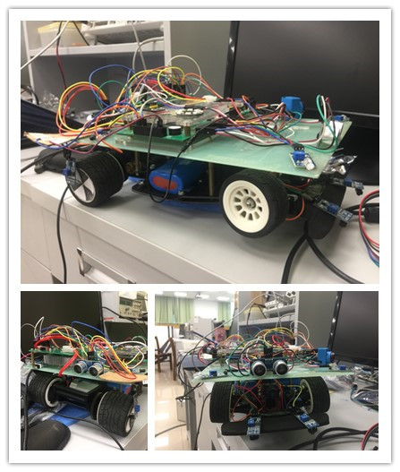
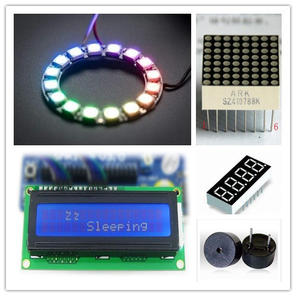

# Electronic design project

## 小车外形

## 元件清单

| 元件名称 | 数量 | 作用 |
|:------:|:---------:|:---------:|
|AMS1117-3.3|2|PCB，稳压|
|AS1015|3|PCB，稳压|
|BTS7960|6|PCB，马达半桥|
| 10k排阻  |  1  |    PCB   | 
|  6.8K, 1.3K, 2.7K，0805封装表贴电阻  |  1 |   PCB  | 
|  10uF 电容(0805封装) |  2 |     PCB   |
| 150mH 电感线圈|1|PCB|
|470uF/25V 和 470uF/16V电容|1|PCB|
|开关|2|PCB|
|马达头子|3|PCB|
|稳压二极管|1|PCB|
|散热片|2|PCB|
|DL-20|2|传感器|
|HC-05|2|传感器|
|红外障碍传感器|若干|传感器|
|超声波传感器|2|传感器|
|OpenMV摄像头|1|传感器|
|触碰传感器|5|传感器|
|温湿度传感器|2|传感器|
|WS2812型灯带|1|输出设备|
|反射型红外传感器|3|传感器|
|12V三片装锂电池组(配充电线)|3|电池|
|A类公头|3|电池头|
|蓝轴7.2V电池组|1|电池备用|
|蓝轴单电机驱动模块V2.1|1|马达驱动备用|
|排针|若干|PCB和日常|
|杜邦线|若干|日常|
|铜棒|若干|日常|
|双面胶and单面胶|1|日常|
|串口转USB接口|2|日常|
|热胶|1|安装散热片|
|1602LCD|1|输出设备|
|8x8点阵|1|输出设备|